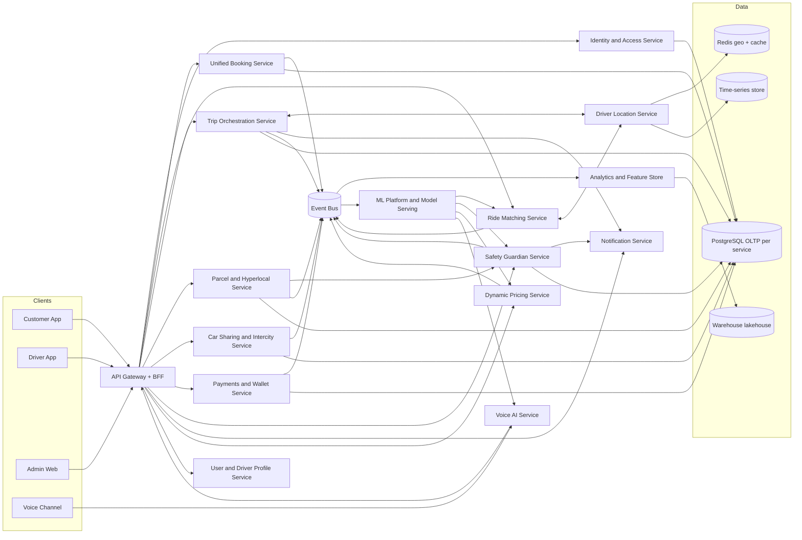

# JAGO Pro Super App: Architecture and Development Blueprint

## 1. Executive Architecture Summary

JAGO Pro will evolve from the current modular monolith (`server/routes.ts` + `server/ai.ts` + Socket.IO) into a domain-driven microservices platform behind an API Gateway, with event-driven real-time workflows and AI-first intelligence modules.

Design goals:
- Serve 10M+ MAU with low-latency ride matching (<1.5s P95 decisioning)
- Zero-downtime rollout from current codebase
- Service isolation by bounded context (rides, parcels, drivers, billing, safety, AI)
- Security-by-default (zero trust service-to-service auth, PII protection, auditability)
- Omni-channel UX: customer, driver, admin, voice, and safety command center

Current-code alignment anchors:
- App entry: `server/index.ts`
- Monolith API + trip lifecycle: `server/routes.ts`
- AI intelligence layer: `server/ai.ts`
- Real-time sockets: `server/socket.ts`
- Push + SMS: `server/fcm.ts`, `server/sms.ts`
- Data model baseline: `shared/schema.ts`
- Existing mobile channels: `flutter_apps/customer_app`, `flutter_apps/driver_app`

## 2. Full System Architecture Diagram

## 3. Backend Microservice Structure

### 3.1 Service decomposition (target)
- `gateway-service`
  - API composition, request auth delegation, rate limiting, A/B routing
- `identity-service`
  - OTP, auth tokens, session management, RBAC, device trust
- `booking-service`
  - Unified booking intent for ride/parcel/car-sharing/intercity/hyperlocal
- `matching-service`
  - Candidate retrieval, score calculation, dispatch strategies, reassign logic
- `trip-service`
  - Trip state machine, OTP milestones, timeline, status transitions
- `location-service`
  - Driver online state, geospatial indexing, route telemetry ingestion
- `pricing-service`
  - Fare quotes, dynamic pricing, surge forecasts, policy rules
- `parcel-hyperlocal-service`
  - Parcel attributes, cargo workflows, two-way OTP delivery gates
- `carshare-intercity-service`
  - Seat inventory, ride publishing, seat allocation, intercity route/fare logic
- `wallet-payment-service`
  - Wallet ledger, settlements, commission/hybrid/subscription models
- `safety-service`
  - SOS orchestration, route deviation, ride guardian, emergency escalation
- `notification-service`
  - Push, SMS, in-app notifications, multilingual templates
- `ai-assistant-service`
  - Wake-word pipeline, ASR, NLU, dialog policy, booking action executor
- `analytics-service`
  - Real-time metrics, anomaly detection, admin insights, BI exports

### 3.2 Event contracts (Kafka or NATS)
Core topics:
- `booking.created`
- `matching.requested`
- `matching.driver_assigned`
- `trip.status_changed`
- `trip.otp_verified.pickup`
- `trip.otp_verified.delivery`
- `safety.alert.raised`
- `payment.settlement.completed`
- `driver.location.updated`
- `ai.voice.intent.resolved`

### 3.3 Runtime stack
- Node.js (TypeScript) microservices
- PostgreSQL per service schema (or per-service DB)
- Redis for geospatial matching + ephemeral state
- WebSocket gateway for sub-second real-time streams
- Kafka/NATS for asynchronous reliability
- OpenTelemetry + Prometheus + Grafana for observability

## 4. AI Voice Assistant Architecture

Wake command: `Hey JAGO Pro`

Pipeline:
1. On-device wake-word detector (low power)
2. Streaming ASR (Telugu + English + Hinglish code-mix)
3. NLU intent extraction (`book_ride`, `send_parcel`, `share_ride`, etc.)
4. Entity extraction (pickup, destination, vehicle preference, schedule)
5. Context resolver
   - GPS pickup
   - Home/work history
   - active trip state
6. Booking action planner
7. Voice confirmation + execution
8. Realtime status narration

Safety and quality controls:
- Confidence thresholds with fallback prompts
- PII redaction in voice logs
- Offensive/harmful request filtering
- Human handoff for uncertain intents

## 5. Intelligent Safety Monitoring System

Safety modules:
- Live route deviation detector
- Abnormal stop detector
- Speed anomaly detector
- Driver identity and trip-context validator
- SOS and silent SOS pipeline
- Family live-share watcher
- Female passenger priority escalation queue
- Shake-to-alert signal processor

Incident severity levels:
- `P3`: informational
- `P2`: suspicious behavior
- `P1`: active risk (ops intervention)
- `P0`: emergency (contact local response + call relay)

## 6. Hyperlocal Delivery System

Unified booking, service-specific fulfillment:
- Instant pickup/drop local zones
- Multi-stop parcels
- Cargo + helper requirement
- Proof-of-pickup and proof-of-delivery
- Two-way OTP (`pickup_otp` to start, `delivery_otp` before completion)
- SLA windows and delayed-delivery automations

## 7. Booking and Dispatch Flow (Unified)

1. Request normalization in `booking-service`
2. Quote calculation via `pricing-service`
3. Driver discovery via `location-service`
4. AI ranking via `matching-service`
5. Broadcast wave strategy with acceptance timer
6. Driver assignment event
7. OTP gate and trip start
8. Safety monitoring stream active
9. Completion, settlement, feedback, analytics

## 8. Customer App Screen Hierarchy (Target)

- Launch and Auth
  - Splash
  - Phone OTP
  - Profile setup
- Home
  - Service carousel (Bike, Auto, Car, Parcel, Car Sharing, Intercity, Hyperlocal)
  - Voice input CTA
  - Smart suggestions
- Booking
  - Pickup and destination
  - Service options + ETA + fare cards
  - Schedule and payment
- Confirmed trip
  - Driver card (photo, rating, vehicle, ETA)
  - Live map tracking
  - Call and chat
  - SOS and share trip
- In-trip
  - OTP display/state
  - Safety guardian status
  - Voice tracking
- Completion
  - Invoice
  - Rating
  - tips and repeat booking
- Parcel flow
  - Sender and receiver details
  - package type and weight
  - pickup OTP and delivery OTP status

## 9. Driver App Workflow (Target)

- Auth and KYC
- Go online/offline
- Incoming request sheet (voice prompt: `Lift Please`)
- Accept/reject timer
- Navigate to pickup
- Arrived state + OTP verify
- Trip in-progress navigation
- Delivery OTP verify (parcel/cargo)
- Complete trip + earnings update
- Heatmap and demand guidance
- Safety controls and incident reports

## 10. Admin Dashboard Modules (Target)

- Control Tower
  - live trips, active incidents, fleet health
- User and Driver Management
  - lifecycle, KYC, sanctions
- Pricing and Surge Studio
  - rule engine, zone policies, time windows
- Ride and Parcel Operations
  - SLA views, dispute handling, manual intervention
- Safety Command Center
  - SOS queue, escalation history, deviation heatmap
- AI Insights
  - demand forecast, anomaly alerts, voice intent quality, model drift
- Revenue and Finance
  - commissions, payouts, wallet liquidity, taxes
- Platform Configuration
  - service toggles, experiments, release rings

## 11. Security and Compliance Baseline

- OAuth2/JWT with short-lived access + refresh tokens
- Device binding + suspicious-login scoring
- Field-level encryption for sensitive PII
- KMS-managed keys
- Audit trails on admin actions
- WAF + bot mitigation + API abuse throttles
- Row-level access controls
- SOC2-ready logging and retention policies

## 12. Scalability and Reliability Targets

- P95 API latency < 250ms for quote and booking APIs
- Matching decision < 1.5s P95
- 99.95% uptime objective
- Multi-AZ deployment
- Idempotent command processing
- Exactly-once or dedupe semantics for critical financial events

## 13. Existing Codebase Upgrade Strategy (Non-breaking)

Phase 0 (now): harden modular monolith
- Keep existing APIs stable in `server/routes.ts`
- Add contract tests and event outbox
- Introduce service-boundary folders while sharing DB

Phase 1: extract high-churn domains
- Extract `location-service`, `matching-service`, `notification-service`
- Keep gateway proxy compatible with old endpoint paths

Phase 2: extract trip + pricing + safety
- Move state machine and pricing rules out of monolith
- Real-time event bridge for socket compatibility

Phase 3: extract voice AI and analytics
- Streaming voice architecture + model gateway
- BI warehouse and feature store

Phase 4: mobile modernization
- Option A: keep Flutter apps, implement new UX + AI features
- Option B: move to native Kotlin/Swift clients via same BFF contracts
- Recommended: dual-track with Flutter continuity + native pilot modules

## 14. Immediate Upgrade Backlog (Next 6-8 weeks)

- Introduce API Gateway and BFF facade without changing app contract
- Implement Outbox pattern in current backend for event-driven migration
- Add Redis geo index for faster driver candidate fetch
- Add `safety-service` skeleton and SOS orchestration contract
- Add voice assistant orchestration service with fallback to current parser
- Build admin control tower pages for live trip/safety monitoring
- Add end-to-end smoke suite for ride, parcel, intercity, car-sharing flows

## 15. Acceptance Criteria

- No regression in existing ride lifecycle and OTP flow
- Feature flags for every new capability
- Backward-compatible API responses for current Flutter apps
- Canary rollout with measurable SLOs
- Security controls validated in pre-production
